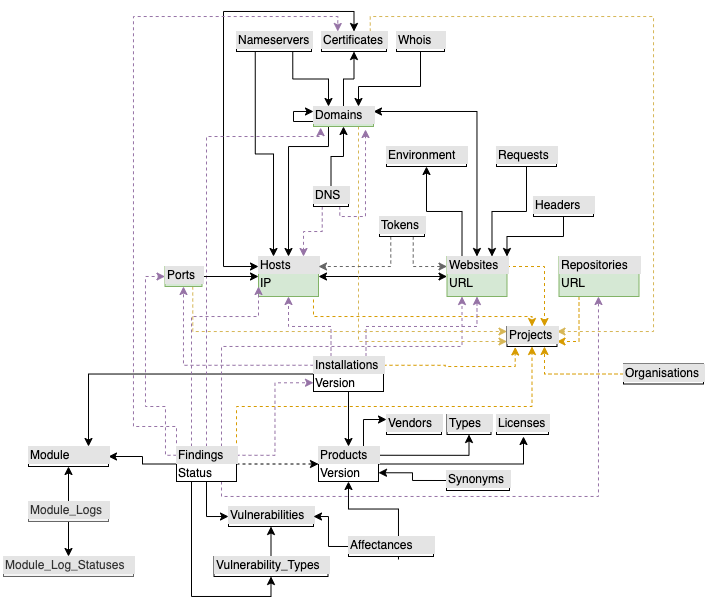

# Internals

## Models explained

There are 7 main assets models:
* Websites
* Domains
* Certificates
* Hosts
* Ports
* Repositories
* Organisations

**Discovery Modules** will run against those assets to discover mode assets (for example, from a Domain, we might discover a Host with a open Port 80 serving a Website), while
**Audit Modules** will run against them, to generate Findings.

**Findings** indicate potential security issues affecting an asset. Once the potential issue gets fixed, if the Module runs again, it will automatically mark the Finding as solved.

**Installation** are **Products** (software, plugins, frameworks, libraries...) that are being used in a Host, Website or Repository.

So, for example, WordPress 4.4 (which is a Product) is installed in site.com Website, and in github.com/site/wordpress Repository. If a vulnerability affecting that particular version comes out, those two installations will be marked as vulnerable, as well as the Website and the Repository.

**Projects** allows to group different assets, making easier to manage different groups of assets.

**Vulnerabilities** are actual public vulnerabilities, obtained from different sources by using **Import Modules**. Those vulnerabilities affect certain Products and belong to a **Vulnerability Type** (SQL Injection, XSS...).
